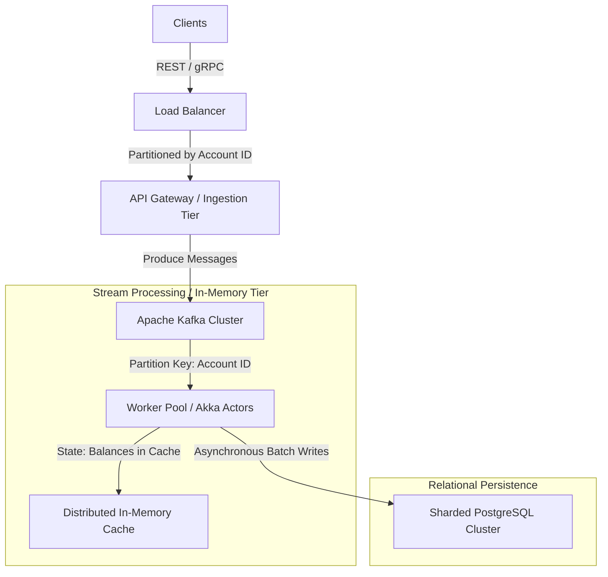

# Ledger Core

> A high-performance, full-stack transaction ledger system designed for consistency, concurrency control, and scalability.
> 
> *Inspired by the [Vaultex](https://www.lakshaymahajan.com/projects/vaultex) project by Lakshay Mahajan.*

---

## Project Overview
**Ledger Core** is a full-stack personal finance and ledger application built primarily as a **System Design & Backend Engineering** practice project. The objective is to use a simple domain—accounts, transactions, balances, and income/expense tracking—to master real-world distributed systems concepts, transaction isolation, and high-concurrency architecture.

This project is tailored for **system design interview preparation**, focusing on concrete solutions to classic backend challenges:
- **Concurrency & Race Conditions**: Preventing double-spending or negative balances.
- **Idempotency**: Ensuring retried requests don't duplicate transactions.
- **Data Consistency**: Maintaining strict alignment between transaction history and account balance.
- **High Scalability**: Designing the system to conceptually scale to **100,000+ transactions per second (TPS)**.

---

## Tech Stack
- **Frontend**: React, TypeScript, Vite, Tailwind CSS.
- **Backend**: Java, Spring Boot, Spring Data JPA.
- **Database**: PostgreSQL (ACID compliant, utilized for row-level locking and uniqueness constraints).
- **API Style**: RESTful API with headers-based metadata.

---

## Concurrency Control: Mutex vs. Database Row Locking

Managing concurrent balance updates is a classic system design question. If a user with a \$100 balance fires two debit requests of \$80 simultaneously, we must ensure only one succeeds.

Here is how the two architectures compare:

### 1. Application-Level Mutex (The Original *Vaultex* Approach)
In this model, the application acquires an in-memory lock (mutex) for the `user_id` before querying the database, checking the balance, and writing the transaction.

* **Pros**: 
  - Extremely fast lock acquisition (in-memory, nanoseconds/microseconds).
  - No database lock overhead; database queries are shielded from lock contention.
* **Cons**:
  - **Single Instance Only**: Works only if there is a single backend server. In a horizontally scaled system with a load balancer, multiple backend instances do not share the same JVM memory, leading to race conditions.
  - **Distributed Lock Complexity**: To scale horizontally, you must replace the in-memory mutex with a distributed locking coordinator like **Redis (Redlock)** or **ZooKeeper**, adding infrastructure complexity, network latency, and failure edge-cases.

### 2. Database Row-Level Locking (The *Ledger Core* Approach)
Instead of locking in the application, we push the synchronization boundary down to the database using PostgreSQL's row-level locking (`SELECT ... FOR UPDATE`).

```sql
-- Lock the user's account row for the duration of the database transaction
SELECT balance FROM accounts WHERE user_id = :userId FOR UPDATE;
```

* **Pros**:
  - **Horizontally Scalable out-of-the-box**: Multiple Spring Boot instances can safely run behind a load balancer; PostgreSQL coordinates the locks centrally.
  - **Simplicity**: No need for a distributed lock manager (Redis). Uses the database's native ACID capabilities.
* **Cons**:
  - **Connection Pool Contention**: Database connections are held open for the duration of the lock. If the critical section contains slow operations (e.g., external API calls), connection pools will quickly exhaust.
  - *Mitigation*: Keep the transactional scope extremely short (DB read -> validation -> DB write -> commit). Never call external network APIs while holding a database lock.

---

## Concurrency Labs & The TOCTOU Problem

To demonstrate these issues visually, Ledger Core includes a **Safety Labs** interface in the frontend:
1. **Idempotency Lab**: Fires multiple identical requests with a single `X-Idempotency-Key` concurrently. Only **one** transaction is created (`201 Created`), while subsequent requests receive the cached result (`200 OK` with an `Idempotency-Replay: true` header).
2. **Concurrency Lab**: Fires multiple concurrent requests with *different* keys. One request holds the lock, while the rest are immediately rejected with a **`409 Conflict`** (Reject-on-Busy strategy) rather than queuing, preserving resource health.

### The TOCTOU (Time of Check to Time of Use) Bug
During development of the concurrency check, a classic race condition can occur if the check and lock acquisition are not atomic:

```
[Request A] ── Check if User Status is 'idle' (True) ───────────────> [Set to 'processing']
[Request B] ────── Check if User Status is 'idle' (True) ───────────> [Set to 'processing']
```

Because of asynchronous latency between checking the state and writing the lock status, both requests pass the check. 
* **The Solution**: The lock must be acquired **synchronously and atomically** the moment the request hits the server. If the lock is busy, the request is immediately rejected.
* **Life Cycle Hook Safeguards**: Locks must be released using response hooks (`finish` and `close`). If a client drops their connection midway, the connection `close` event ensures the lock is freed, avoiding stuck accounts.

### The Idempotency Check Race Condition (TOCTOU in DB Transactions)
In the initial transaction flow proposed in `PROJECT_DESIGN.md`, the idempotency check is performed *before* acquiring the database row lock. This creates a critical race condition:

```
[Request A] ── Check Idempotency Key (Doesn't Exist) ──> Acquire Row Lock (Success) ──> Commit Write
[Request B] ── Check Idempotency Key (Doesn't Exist) ──> Acquire Row Lock (Blocked) ... Wait ... Unblocks ──> Attempt Write (FAIL with Unique Constraint Exception)
```

Because Request B performs the idempotency check *before* Request A commits, it does not see the key. When it finally acquires the lock, it blindly attempts the write, resulting in a database unique constraint violation (`500 Internal Server Error` or exception) instead of returning a clean cached response of Request A.

#### The Corrected Database Transaction Flow:
To fix this, the idempotency check must occur **inside** the locked transaction block, *after* the row lock is acquired:

```
Request
   │
   ▼
Spring Boot
   │
   ▼
BEGIN TRANSACTION
   │
   ▼
Lock User Account Row (SELECT ... FOR UPDATE)
   │
   ▼
Query Idempotency Key (Inside Lock)
   ├── Key Exists ───────────────────────────> COMMIT/ROLLBACK ──> Return Replay (200 OK + Header)
   └── Key Does Not Exist
         │
         ▼
      Check Balance Invariant
         ├── Insufficient ───────────────────> ROLLBACK ──> Return Error (422/400)
         └── Sufficient
               │
               ▼
            Insert Transaction & Update Balance ──> COMMIT ──> Return Success (201 Created)
```

By querying the idempotency key *after* locking the user row, any concurrent request with the same key is forced to wait until the first request completes and commits. The second request then queries the table, finds the newly committed transaction, and returns it safely.

---

## Scaling to 100,000+ Transactions Per Second (TPS)

A single relational database instance (like PostgreSQL) maxes out around 10k–40k TPS under standard workloads due to disk write limits (Write-Ahead Log (WAL) synchronization) and lock contention on single account rows. 

To scale Ledger Core to **100k+ TPS**, we must evolve the architecture using the following system design patterns:



### 1. Partitioning & Sharding (Scale-Out Data Tier)
* **Strategy**: Horizontally partition (shard) the database by `account_id` or `user_id`.
* **Execution**: Instead of routing all transactions to a single PostgreSQL instance, database routing middleware (e.g., **Vitess** or Spring's dynamic data source routing) routes requests across a cluster of (say, 10) database shards. Since transactions for different accounts are independent, we achieve linear scaling.

### 2. Memory-First Architecture & Actor Model
* **Strategy**: Remove disk write bottlenecks from the critical path of transaction verification.
* **Execution**: Implement an actor-based architecture (using **Java Virtual Threads** or frameworks like **Pekko/Orleans**). 
  - Each account behaves as a single in-memory Actor.
  - Transactions for a specific account are queued and processed sequentially by that account's actor in-memory.
  - Since memory operations take nanoseconds, balance verification and updates are incredibly fast. No database row-locks are needed.

### 3. Event Sourcing & Message Queues
* **Strategy**: Transition from synchronous CRUD API calls to asynchronous event streaming.
* **Execution**:
  - Ingest transactions into a distributed messaging system like **Apache Kafka**, partitioned by `account_id`.
  - Kafka guarantees that all transactions for a specific account are routed to the same partition and processed strictly in the order they arrived.
  - Background consumers process transactions from Kafka in batches, writing them to PostgreSQL in bulk. Batch inserts bypass individual transaction commit overhead, increasing database write throughput by up to 50x.

### 4. Write-Behind Caching
* **Strategy**: Cache the source of truth for balances and sync to disk asynchronously.
* **Execution**: Use a distributed memory grid (e.g., **Redis** or **Apache Ignite**). A transaction immediately updates the balance in the cache (Write-Through/Write-Behind) and is written to a fast append-only transaction log. The main relational database (PostgreSQL) is updated asynchronously for cold storage and reporting.

---

## Deployment Strategy

For showcasing this application as a production-ready portfolio item, here is a comparison of hosting choices:

| Service / Role | Deployment Option |
| :--- | :--- |
| **Backend & Database** | **PaaS (Render / Railway / Fly.io)** — Deploy the Spring Boot app and PostgreSQL for free. |
| **Frontend** | **Netlify** — Host the React UI and point API calls to the backend. |

---