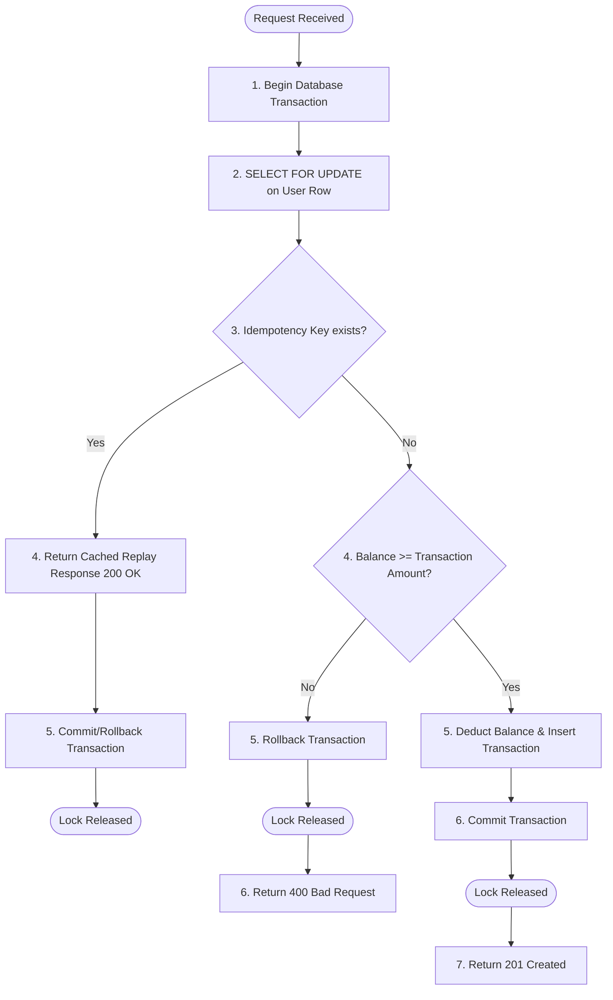

# Ledger Core

> A high-performance, full-stack transaction ledger system designed for consistency, concurrency control, and scalability.
> 
> *Inspired by the [Vaultex](https://www.lakshaymahajan.com/projects/vaultex) project by Lakshay Mahajan.*

---

## Table of Contents
1. [Project Overview](#project-overview)
2. [Tech Stack](#tech-stack)
3. [Backend Architecture & API Design (docs/BACKEND.md)](#backend-architecture--api-design)
4. [Concurrency Control & Simulation Scenarios (docs/SCENARIOS.md)](#concurrency-control--simulation-scenarios)
5. [Frontend Safety Labs (docs/FRONTEND.md)](#frontend-safety-labs)
6. [Deployment Strategy](#deployment-strategy)

---

## Project Overview
**Ledger Core** is a full-stack personal finance and ledger application built primarily as a **System Design & Backend Engineering** practice project. The objective is to use a simple domain—accounts, transactions, balances, and income/expense tracking—to master real-world distributed systems concepts, transaction isolation, and high-concurrency architecture.

It focuses on concrete solutions to classic backend challenges:
- **Concurrency Control**: Preventing double-spending or negative balances.
- **Idempotency**: Ensuring retried requests don't duplicate transactions.
- **Data Consistency**: Maintaining strict alignment between transaction history and account balance.

---

## Tech Stack
- **Frontend**: React, TypeScript, Vite, Tailwind CSS.
- **Backend**: Java, Spring Boot, Spring Data JPA.
- **Database**: PostgreSQL (ACID compliant, utilized for row-level locking and uniqueness constraints).
- **API Style**: RESTful API with path-variable-driven routing and standard JSON responses (no custom HTTP headers).

---

## Backend Architecture & API Design
The backend is built with Spring Boot and JPA, using a highly scalable, RESTful path-variable-driven API structure. All operations coordinate inside database transaction boundaries to maintain strict atomic integrity.

For a complete breakdown of endpoints, the data model schema, idempotency design, and CORS configuration:
See the detailed [docs/BACKEND.md](docs/BACKEND.md) file.

---

## Concurrency Control & Simulation Scenarios
Ledger Core explores different concurrency protection strategies:

### 1. Application-Level Mutex (Single-Instance JVM)
Requests for the same user ID are serialized inside the JVM memory block.

```text
Spring Boot Instance
 ├── Thread 1 (User A) ──> Acquire Local Mutex (Success) ──> DB Write ──> Release Mutex
 └── Thread 2 (User A) ──> Acquire Local Mutex (Blocked) ──> Wait...
```

*Limits*: Under a load balancer with multiple backend instances, local JVM locks cannot coordinate:

```text
Spring Boot Instance 1 (Local Mutex A)  ──\
                                           ├──> Race Condition on Database Row!
Spring Boot Instance 2 (Local Mutex B)  ──/
```

### 2. Database Row-Level Locking (Pessimistic `SELECT ... FOR UPDATE`)
We push the serialization boundary to PostgreSQL, allowing multiple Spring Boot instances to scale horizontally:

```text
Spring Boot Instance 1 ──\
Spring Boot Instance 2 ───┼──> PostgreSQL Row Lock (Centralized Coordination)
Spring Boot Instance 3 ──/
```

### Transaction Execution Flow (Lock-then-Check)
To prevent TOCTOU (Time-of-Check to Time-of-Use) race conditions, the idempotency check and invariant validation must happen *inside* the locked transaction:



For visual execution diagrams, sequence charts, comparative locking metrics, and concurrency sandbox mechanics:
See the detailed [docs/SCENARIOS.md](docs/SCENARIOS.md) file.

---

## Frontend Safety Labs
The React-based frontend features a dashboard equipped with interactive safety/simulation playgrounds:
- **Idempotency Lab**: Verifies duplicate request suppression.
- **Concurrency Lab**: Forces thread contention to demonstrate race conditions vs. serialized execution.

For details on state management, components, and client-side setup:
See the detailed [docs/FRONTEND.md](docs/FRONTEND.md) file.

---

## Deployment Strategy

For showcasing this application as a production-ready portfolio item, here is a comparison of hosting choices:

| Service / Role | Deployment Option |
| :--- | :--- |
| **Backend & Database** | **PaaS (Render / Railway / Fly.io)** — Deploy the Spring Boot app and PostgreSQL for free. |
| **Frontend** | **Netlify** — Host the React UI and point API calls to the backend. |

---