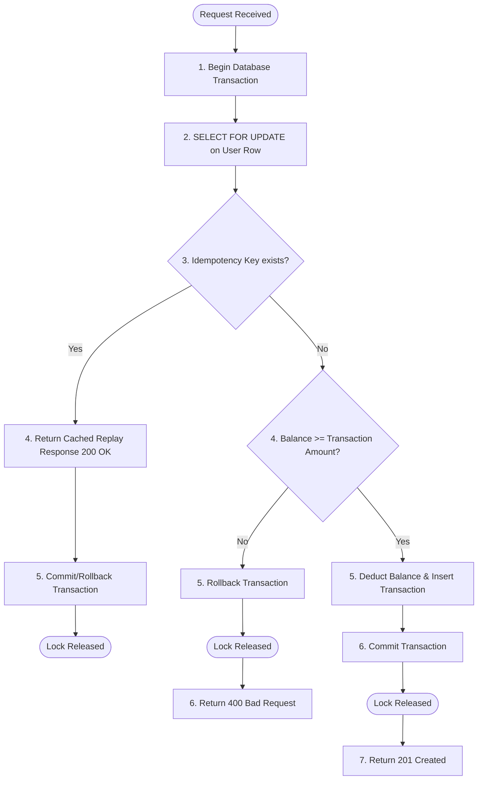

# Concurrency Scenarios & Use Cases

This document details the concurrency architectures considered for the **Ledger Core** project, analyzes when and why each architecture is valid, and provides a guide to the Concurrency Lab Sandbox.

---

## 1. Concurrency Control Architectures

### A. Application-Level Mutex (In-Memory JVM Locks)
* **How it works**: Uses standard language synchronization mechanisms (e.g., `synchronized` blocks, Java `ReentrantLock`) to serialize requests for a specific user ID in the application memory tier.
* **Pros**: 
  - Extremely fast (sub-microsecond lock acquisition).
  - No database lock overhead or contention.
* **Cons**:
  - Bound to a single application instance. Does not scale horizontally.
  - If a load balancer distributes concurrent requests for the same user across different backend nodes, the local locks will not coordinate, leading to race conditions.
* **Best Use Cases**:
  - Single-instance monoliths.
  - Non-critical, low-traffic APIs.
  - Applications with sticky sessions where all traffic for a specific user is guaranteed to route to the exact same server instance.

---

### B. Database Row-Level Locking (Pessimistic write - `SELECT ... FOR UPDATE`)
* **How it works**: The backend initiates a database transaction and requests a pessimistic write lock on the target user's row. Subsequent database queries trying to read/write the same row with a lock are blocked until the first transaction commits or rolls back.
* **Pros**:
  - Extremely robust and ACID-compliant.
  - Works natively with horizontal scaling of application instances (PostgreSQL coordinates the lock).
  - Simple implementation without external dependencies (no Redis required).
* **Cons**:
  - Database connection pool exhaustion if transactions are held open too long (e.g., during external API calls).
  - Database lock contention on high-frequency account transactions (hotspot rows).
* **Best Use Cases**:
  - Transaction-heavy systems, financial ledgers, and billing engines where correctness is paramount.
  - Mid-scale applications (up to 10k–40k TPS depending on sharding and hardware).
  - Systems already using an ACID database that want to scale horizontally without introducing Redis.

---

## 2. Transaction Execution Flow (Lock-then-Check)

Here is the correct operational sequence of the transaction execution flow when database row-level locking is enabled. The idempotency key check and invariant verification are safely wrapped inside the pessimistic row lock boundary:

### Operational Flowchart



### Flow Diagram

```text
Request
   |
   v
Spring Boot
   |
   v
BEGIN DATABASE TRANSACTION
   |
   v
SELECT user/account ... FOR UPDATE
   |
   v
Row is locked
   |
   v
Query Idempotency Key (Inside Lock)
   ├── Key Exists ───────────────────────────> COMMIT/ROLLBACK ──> Return Replay (200 OK, replayed = true)
   └── Key Does Not Exist
         │
         v
      Check Balance Invariant
         ├── Insufficient ───────────────────> ROLLBACK ──> Return Error (400 Bad Request)
         └── Sufficient
               │
               v
            Insert Transaction & Update Balance ──> COMMIT ──> Return Success (201 Created)
```

---

## 3. Pessimistic vs. Optimistic Locking

| Metric | Pessimistic Locking (`SELECT FOR UPDATE`) | Optimistic Locking (`@Version`) |
| :--- | :--- | :--- |
| **Strategy** | Block other readers/writers until finished. | Allow parallel reads/writes; fail the commit if the version changed. |
| **Concurrency** | Low concurrency on the same row; high safety. | High concurrency on the same row; high rollback rates. |
| **Use Case** | High contention, high conflict rate (e.g., rapid debiting). | Low contention, low conflict rate (e.g., user updating profile info). |
| **Failure Cost** | Thread waits (latency); low failure rate. | Immediate error; requires client-side retry logic. |

---

## 4. Concurrency Lab Sandbox Mechanics

The sandbox provides two toggleable simulation modes covering both Database Row-Level Locking and Application JVM-Level Locking:

### Scenario 1: Database Row-Level Locking (`POST /api/v1/ledger/users/{userId}/transactions`)

#### A. Lock-Disabled Mode (`disableLocking=true`)
When `disableLocking` is enabled, the backend:
1. Queries the database using a standard `SELECT` (bypassing `FOR UPDATE`).
2. Introduces an **artificial 100ms delay** (`Thread.sleep(100)`) between the check (read) and write (update) phases.
3. Concurrent requests read the same initial balance, bypass the checks, and execute overlapping updates. This triggers the **TOCTOU (Time-of-Check to Time-of-Use)** race condition, causing the balance to become negative or inconsistent.

#### B. Lock-Enabled Mode (`disableLocking=false`)
When `disableLocking` is disabled (default):
1. The backend queries the user row using `SELECT ... FOR UPDATE`, instantly locking it.
2. If a second request arrives, PostgreSQL blocks it on the lock acquisition query.
3. The first request completes its verification, saves the transaction, commits, and releases the lock.
4. The second request unblocks, reads the updated balance, and correctly rejects the request with a `400 Bad Request` due to insufficient balance. Data integrity remains 100% intact.

---

### Scenario 2: Application JVM-Level Locking (`POST /api/v1/ledger/users/{userId}/transactions/jvm`)

#### A. Lock-Disabled Mode (`disableJvmLocking=true`)
When `disableJvmLocking` is enabled, the backend:
1. Bypasses the in-memory JVM synchronization lock for the user's ID.
2. Executes the transaction operations under a normal database transaction using standard non-locking `SELECT` and introduces a 100ms artificial delay.
3. Overlapping threads simultaneously query and validate the balance, leading to double-debits and balance inconsistency.

#### B. Lock-Enabled Mode (`disableJvmLocking=false`)
When `disableJvmLocking` is disabled (default):
1. The backend resolves a lock object specifically for the user ID using a `ConcurrentHashMap` of user-specific locks.
2. The executing thread acquires the in-memory monitor lock using a Java `synchronized` block.
3. While holding the lock, it initiates the database transaction programmatically using `TransactionTemplate`, ensuring the database transaction starts, queries the balance (non-locking `SELECT`), commits the changes, and finishes *inside* the synchronized block boundary before the JVM lock is released.
4. If a second concurrent request arrives for the same user ID, it is blocked on the Java monitor lock, waiting for the first request's database transaction to fully commit and release the lock.
5. Once unblocked, the second thread executes, reads the newly committed balance, and is rejected with `400 Bad Request`.
